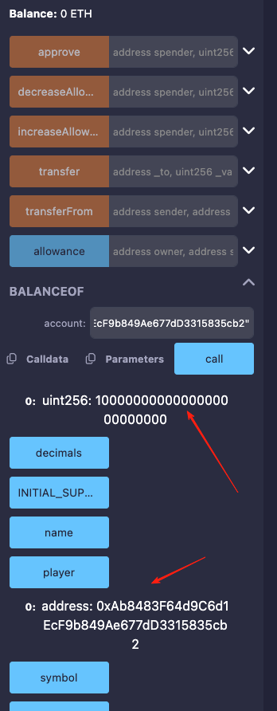
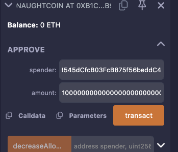
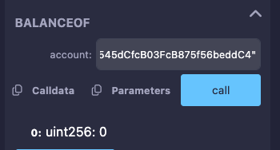
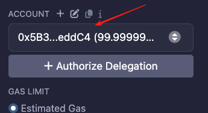
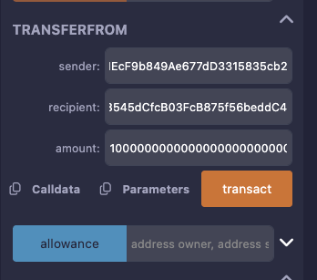
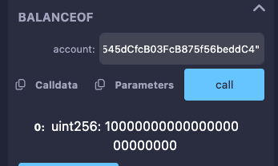
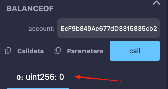

# 15. Naught Coin

### 原题
NaughtCoin 是一种 ERC20 代币，而且您已经持有这些代币。问题是您只能在 10 年之后才能转移它们。您能尝试将它们转移到另一个地址，以便您可以自由使用它们吗？通过将您的代币余额变为 0 来完成此关卡。

```solidity
// SPDX-License-Identifier: MIT
pragma solidity ^0.8.0;

import "openzeppelin-contracts-08/token/ERC20/ERC20.sol";

contract NaughtCoin is ERC20 {
    // string public constant name = 'NaughtCoin';
    // string public constant symbol = '0x0';
    // uint public constant decimals = 18;
    uint256 public timeLock = block.timestamp + 10 * 365 days;
    uint256 public INITIAL_SUPPLY;
    address public player;

    constructor(address _player) ERC20("NaughtCoin", "0x0") {
        player = _player;
        INITIAL_SUPPLY = 1000000 * (10 ** uint256(decimals()));
        // _totalSupply = INITIAL_SUPPLY;
        // _balances[player] = INITIAL_SUPPLY;
        _mint(player, INITIAL_SUPPLY);
        emit Transfer(address(0), player, INITIAL_SUPPLY);
    }

    function transfer(address _to, uint256 _value) public override lockTokens returns (bool) {
        super.transfer(_to, _value);
    }

    // Prevent the initial owner from transferring tokens until the timelock has passed
    modifier lockTokens() {
        if (msg.sender == player) {
            require(block.timestamp > timeLock);
            _;
        } else {
            _;
        }
    }
}
```
### 分析
`NaughtCoin`是一个ERC20标准的代币，\
通过继承了openzepplin的ERC20合约来实现了代币的基础功能。\
在初始化的时候，给`player`铸造了一些代币。\
同时有个锁定期`timeLock`, \
重载了`transfer`方法，加上了锁定期的修饰符。\
必须10年后才可以转账使用。\
这就像是富豪给子女的遗产，必须要一定年限后才能使用。\
防止不争气的子女，纸醉金迷，挥霍而光，最后还哭爹喊娘。\
言归正传，我们直接使用`transfer`肯定是不行了，\
必须要想办法绕过去。\
我们知道ERC20的标准里，除了`transfer`转账，还有`approve`和`transferFrom`,\
这两个方法的意思是可以预先授权指定的第三方可以使用一定额度的代币。\
这两个方法都没有重载，也就没有`timeLock`的限制。\
首先`approve({ 另一个账号 }，{ 被转账账号的所有余额 } )`，\
然后`transferFrom({ 被转账的账号 }, { 另一个账号 }, { 被转账账号的所有余额 })`。\
通过这么一绕，资金就到了另一个账户中了，\
等于做了资产转移。\
我们在remix中进行模拟。\
【1.初始化】 \
player: 0xAb8483F64d9C6d1EcF9b849Ae677dD3315835cb2
spender: 0x5B38Da6a701c568545dCfcB03FcB875f56beddC4
首先初始化，传入player地址，部署成功后，查询player的余额和地址

 

【2. approve】

调用`approve`方法，授权spender这个账户可以消费player的所有余额。

 

【3. transferFrom】

调用`transferFrom`方法，将player账户的全部余额全部转给spender账户。\
在转移之前，我们先来确定player账户和spender账户余额情况。

 

首先保证我们现在的操作账号spender 



执行`transderFrom`



spender得到player账户全部余额



此时player账户为零




