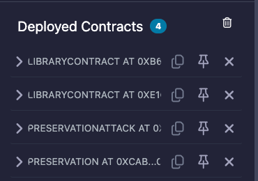
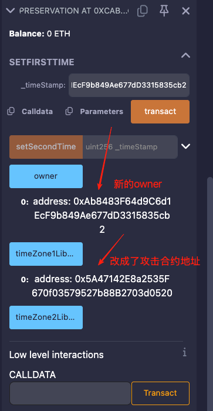

# 16. Preservation
### 原题
该合约利用库合约保存 2 个不同时区的时间戳。合约的构造函数输入两个库合约地址用于保存不同时区的时间戳。

通关条件：尝试取得合约的所有权（owner）。
```solidity
// SPDX-License-Identifier: MIT
pragma solidity ^0.8.0;

contract Preservation {
    // public library contracts
    address public timeZone1Library;
    address public timeZone2Library;
    address public owner;
    uint256 storedTime;
    // Sets the function signature for delegatecall
    bytes4 constant setTimeSignature = bytes4(keccak256("setTime(uint256)"));

    constructor(address _timeZone1LibraryAddress, address _timeZone2LibraryAddress) {
        timeZone1Library = _timeZone1LibraryAddress;
        timeZone2Library = _timeZone2LibraryAddress;
        owner = msg.sender;
    }

    // set the time for timezone 1
    function setFirstTime(uint256 _timeStamp) public {
        timeZone1Library.delegatecall(abi.encodePacked(setTimeSignature, _timeStamp));
    }

    // set the time for timezone 2
    function setSecondTime(uint256 _timeStamp) public {
        timeZone2Library.delegatecall(abi.encodePacked(setTimeSignature, _timeStamp));
    }
}

// Simple library contract to set the time
contract LibraryContract {
    // stores a timestamp
    uint256 storedTime;

    function setTime(uint256 _time) public {
        storedTime = _time;
    }
}
```
### 分析
这道题的难度比之前的题目要高一颗星。\
如果是对delegatecall的机制没有比较深的理解, 是很找到突破口的。\
delegatecall用目标合约的逻辑来操作自己的存储空间数据。\
上面这句话听起来比较抽象，怎么又是操作自己的存储空间了，不是操作目标合约的空间吗?\
EVM对于（定长， 非动态， 未跨槽打包）状态变量编译的计算结果是存储槽编号。\
题目中的变量都是定长的变量，所以运行字节码里都是直接通过编号来找到变量存储位置。\
一旦使用delegatecall调用目标合约某个方法，方法里操作的其实是本合约的`同编号`的存储槽。\
只是借用了目标合约的方法而已。\
我们就可以看到在Preservation合约中：\
`address public timeZone1Library => slot0` \
`address public timeZone2Library => slot1` \
`address public owner => slot2` \
`uint256 storedTime => slot3` \
在LibraryContract合约中：\
`uint256 storedTime => slot0`\
在两个合约中，slot0是重叠的，\
也就是说，使用delegatecall调用`setTime`,\
其实是修改的`timeZone1Library`变量。\
如果是要访问到owner这个变量，那么我们在攻击合约中，\
需要构造和Preservation合约一致的变量布局，同编号访问到owner。\
还有个问题，怎么才能让Preservation合约可以和攻击合约交互呢？\
我们看Preservation合约的`setFirstTime`，\
里面的执行其实是在修改`timeZone1Library`这个变量,\
那如果我们可以调用`setFirstTime`，把`timeZone1Library`的值改成攻击合约地址就大功告成了。\
还有最后一个问题需要解决。
`setFirstTime`需要的参数类型是`uint256`, 而地址类型是`address`。\
是20字节的16进制数。那就是`uint160`。\
同时虽然函数中参数类型是`uint256`，地址是`uint160`， 这个会触发安全的隐式转换。\
在底层的存储槽是32字节大小，不论`uint160`还是`uint256`，都是原样存储。\
存储槽没有类型的概念。\
当我们传入`uint160`类型的数据并保存后。语言层面，使用`address`的类型来读取低位160位。\
所以我们可以直接把地址作为参数传入。\
总结一句话，我们要造一个假的LibraryContract合约，\
方法相同，变量布局和Preservation合约一致。\
攻击合约很简单。
```solidity
// SPDX-License-Identifier: MIT
pragma solidity ^0.8.0;

contract PreservationAttack {
    address public v1;
    address public v2;
    // 重点在这里，和Preservation合约的owner变量是相同的存储槽编号
    uint256 public storedTime;
    
    // 和LibraryContract合约的setTime方法的签名保持一致
    function setTime(uint256 _time) public {
        storedTime = _time;
    }
}
```
### 破解过程
在remix部署了4个合约


LibraryContract1 => 0xb6E82f13D5E6e433a41CF39789061Bc61c70444c

LibraryContract2 => 0xE16c692215F3001244947bd2452944e98CF2dB55

Prevervation     => 0xcAba93D84F9E1Eb8F90D38cBEad5f683F14c4b1b

PrevervationAttack => 0x5A47142E8a2535F670f03579527b88B2703d0520

new owner  => 0xAb8483F64d9C6d1EcF9b849Ae677dD3315835cb2

【1. 替换攻击合约地址】
首先利用Preservation合约的`setFirstTime`方法，输入攻击合约的地址，这样将`timeZone1Library`改为攻击合约地址。

【2. 更改owner】
再次调用Preservation合约的`setFirstTime`方法，输入我们自己的地址（0xAb8483F64d9C6d1EcF9b849Ae677dD3315835cb2），作为新的owner。其实就这么完成了，实施起来很简单。



