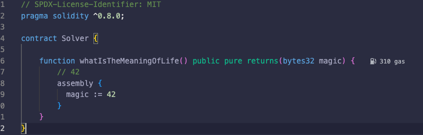
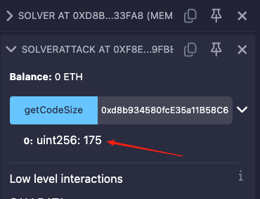
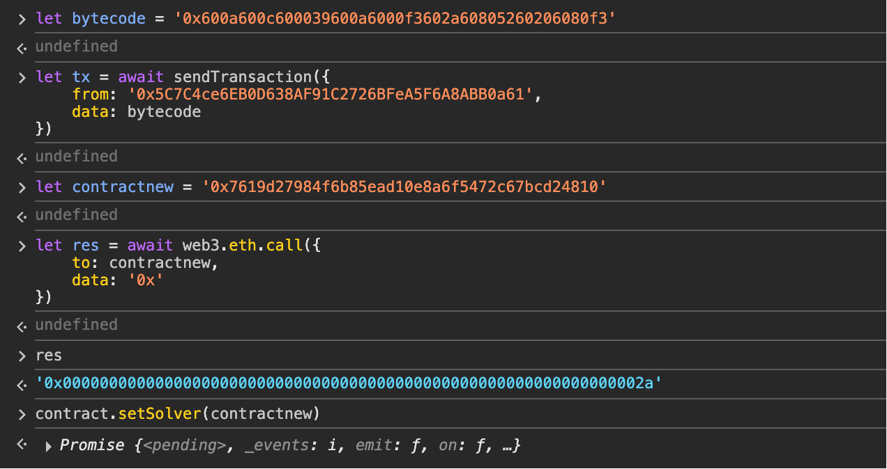

# 18. MagicNumber
### 原题
要通过这一关，你只需要给 Ethernaut 提供一个 Solver，也就是一个在被调用 whatIsTheMeaningOfLife() 时返回正确 32 字节数字的合约。

听起来很简单吧？嗯……不过有个陷阱。

Solver 的代码必须非常非常小。真的非常非常非常小。极其极其微小：最多 10 字节。

提示：也许是时候暂时离开 Solidity 编译器的舒适区，手工构建这个了 O_o。没错：原始 EVM 字节码。
```solidity
// SPDX-License-Identifier: MIT
pragma solidity ^0.8.0;

contract MagicNum {
    address public solver;

    constructor() {}

    function setSolver(address _solver) public {
        solver = _solver;
    }

    /*
    ____________/\\\_______/\\\\\\\\\_____        
     __________/\\\\\_____/\\\///////\\\___       
      ________/\\\/\\\____\///______\//\\\__      
       ______/\\\/\/\\\______________/\\\/___     
        ____/\\\/__\/\\\___________/\\\//_____    
         __/\\\\\\\\\\\\\\\\_____/\\\//________   
          _\///////////\\\//____/\\\/___________  
           ___________\/\\\_____/\\\\\\\\\\\\\\\_ 
            ___________\///_____\///////////////__
    */
}
```
### 分析
乍一看，觉得这个不是很简单吗？\
三下五除二，很快就在remix上写了一个Solver合约。\

看到自己的效率这么神速，被自己的天才而感动的痛哭流涕。\
迫不及待部署到sepolia测试网上，\
根据题目要求调用`setSolver(address _solver)`, \
迅速的点击`提交该实例`,完美交卷, 奥利给！\
看到交易确定后，就等通关的提示了。\
但是...\
 \
感觉之前的得意，一下被打到了谷底，怎么回事？\
怎么没按照我设计的剧情发展呢？\
冷静下，冷静下，再仔细看看题目要求。\
原题里有个最大的要求是合约代码要非常小，不能大于10字节。\
同时还暗示了，要手工创建原始的EVM字节码。\
拍拍自己的脑袋，清醒下吧。开始研究怎么写EVM字节码。\
我们先来研究下，为什么失败吧。\
写了一个合约，用来计算之前的合约运行时代码有多少字节。\
```solidity
// SPDX-License-Identifier: MIT
pragma solidity ^0.8.0;

contract SolverAttack {

    function getCodeSize(address _to) public view returns(uint256) {
        return _to.code.length;
    }
}
```
将2个合约都部署到本地环境，然后得到代码大小：\
 \
我们可以看到175个字节，远远大于10个字节。\
看来手搓的字节码要减少到极致才能满足不超过10字节。\
我们还是来了解下合约部署和合约发起调用请求单的时候，\
EVM执行了哪些动作，做了哪些事情。\
我们可以根据EVM的流程设计一个最简化的过程，\
只要保证执行结束能返回42就好。
1. 将42压入栈顶 \
`PUSH1(0x60) 0x2a` 
2. 内存地址0x80压入 \
`PUSH1(0x60) 0x80` 
3. 需要2个参数(offset, value) ,需要在堆栈上去取(0x80,0x20), 栈清空。看到这个，大家就知道为什么第一步是要惨把42压入，因为MSTORE的参数顺序，同时堆栈是后进先出的机制。 \
`MSTORE(0x52)` 
4. RETURN指令需要在内存里取数的长度 \
`PUSH1(0x60) 0x20` 
5. RETURN指令扫描内存的起始位置 \
`PUSH1(0x60) 0x80` 
6. 表示执行成功需要返回数据(offset, size)， 对应参数就是(0x80, 0x20) \
`RETURN(0xf3)` 

将上面的指令集组合成字节码: \
`0x602a60805260206080f3`这个正好是10个字节，大小是满足要求的。\
这个就是运行时字节码。\
接下来的就是怎么将这个字节码部署到测试网上。\
EVM在部署合约的时候，需要部署码把运行时字节码复制到内存并RETURN，最后保存到链上。\
因此，有2个重要的指令: \
`CODECOPY(destOffset, offset, size)` \
`RETURN(offset, size)` \
所以我们就要按照CODECOPY的参数顺序，\
向栈中压入3个参数(size, offset, destOffset)。\
那我们就可以这样设计部署流程。
1. 将运行时字节码的长度size，压入 
   `PUSH1 0x0a`
2. 将运行时字节码在整个部署字节码的偏移量压入 
   `PUSH1 Ox0c`
3. 将准备存放运行时字节码的起始位置压入
   `PUSH1 0x00`
4. 执行CODECOPY指令，堆栈清空
   `CODECOPY`
5. 将RETURN需要读取的字节大小压入
   `PUSH1 0x0a`s
6. 将运行时代码在内存的起始位置压入
   `PUSH1 0x00`
7. 执行RETURN指令，堆栈清空，成功返回
   `RETURN`
指令合并后： `0x600a600c600039600a6000f3`,一共12个字节。\
我们将部署字节码和运行时字节码合并：\
`0x600a600c600039600a6000f3602a60805260206080f3` \
上面的字节码，就是整个部署我们的合约的整个字节码。\
我们可以通过发动交易的方式部署到测试网上。


好了，输出是我们预期的结果。\
交易确定后，我们就可以提交答案了。\
OK，过关!!
### 总结
https://www.evm.codes/

https://ethereum.org/zh/developers/docs/evm/