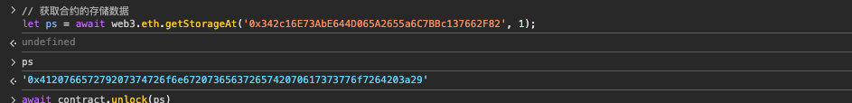
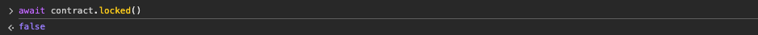

# 8. Vault
### 原题
```
打开 vault 来通过这一关!
```
```solidity
// SPDX-License-Identifier: MIT
pragma solidity ^0.8.0;

contract Vault {
    bool public locked;
    bytes32 private password;

    constructor(bytes32 _password) {
        locked = true;
        password = _password;
    }

    function unlock(bytes32 _password) public {
        if (password == _password) {
            locked = false;
        }
    }
}
```
### 分析
泰裤辣！让我们打开金库。这个就像是真的黑客盗取银行金库，打洞，屏蔽信号，红外线探查...想想都刺激！\
醒醒，哥们，现在只是在做题。\
我们看看这个unlock函数，只有知道password，才能使得locked = false；\
但是想想谁会这么傻，会把密码公之于众呢？你看，password 还是用的  private 来限制呢？\
在去中心化的这个大环境中，信息透明公开是第一要素。所以不要被传统开发语言给带偏了，private 在这里并不是私有隐藏，在区块链浏览器上是可以看到password值的。private只是对继承关系有限制作用。\
OK, 这个好办了，去查看下这个值就可以。就像去保安室直接去拿钥匙一样方便。

```solidity
// 在这个题目的页面，打开浏览器调试工具，可以在console界面使用ethers.js的接口，查询password
let ps = await web3.eth.getStorageAt('0x342c16E73AbE644D065A2655a6C7BBc137662F82', 1);

// 不要问我这个1是什么，这个就是存储槽的编号，看password的定义的顺序
```

